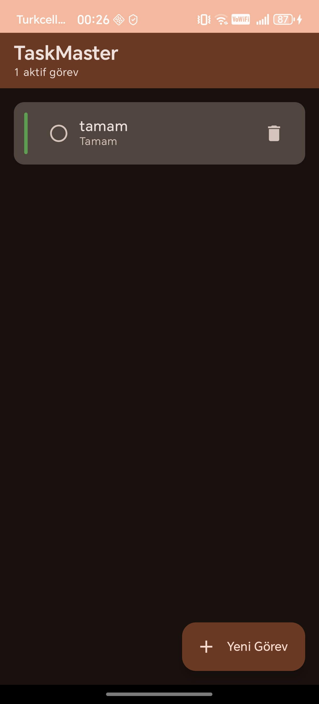

# 📋 TaskMaster — Modern Android Görev Yöneticisi

[](https://kotlinlang.org/)
[](https://developer.android.com/jetpack/compose)
[](https://m3.material.io/)
[](#)
[](https://opensource.org/licenses/MIT)

Jetpack Compose, Room ve MVVM mimarisi kullanılarak geliştirilmiş, modern Android geliştirme pratiklerini sergileyen tam donanımlı bir görev yöneticisi uygulaması.

---

## ✨ Özellikler

- ✅ **Görev oluşturma, düzenleme ve silme**
- 🎯 **Öncelik seviyeleri** (Düşük / Orta / Yüksek) — renkli görsel göstergelerle
- ✔️ **Tamamlandı işaretleme** — tek dokunuşla
- 🗑️ **Toplu temizleme** — tamamlanan tüm görevleri tek seferde silme
- 🌙 **Dark / Light tema** — sistem ayarlarına otomatik uyum
- 🎨 **Dynamic Color** desteği (Android 12+) — kullanıcının duvar kağıdı renklerine uyum
- 💾 **Yerel veri saklama** — Room veritabanı ile offline çalışır
- ⚡ **Reactive UI** — Kotlin Flow ile anlık güncellemeler

---

## 🛠️ Teknoloji Yığını

| Kategori | Teknoloji |
|----------|-----------|
| **Dil** | Kotlin 1.9 |
| **UI** | Jetpack Compose + Material 3 |
| **Mimari** | MVVM (Model-View-ViewModel) |
| **Veritabanı** | Room Persistence Library |
| **Asenkron** | Kotlin Coroutines + Flow |
| **Navigation** | Navigation Compose |
| **DI** | Manuel DI (Application class üzerinden) |
| **Build** | Gradle (Kotlin DSL) |

---

## 🏗️ Mimari

Proje, **Clean Architecture** prensiplerine uygun olarak katmanlı bir yapıda tasarlanmıştır:

```
com.taskmaster.app
├── data/              # Veri katmanı
│   ├── Task.kt              → Entity
│   ├── TaskDao.kt           → Data Access Object
│   ├── TaskDatabase.kt      → Room Database
│   └── TaskRepository.kt    → Repository pattern
├── ui/                # Sunum katmanı
│   ├── screens/             → Composable ekranlar
│   ├── viewmodel/           → ViewModel + Factory
│   └── theme/               → Material 3 tema
├── navigation/        # Ekranlar arası geçişler
└── MainActivity.kt    # Entry point
```

**Veri akışı:** `UI ↔ ViewModel ↔ Repository ↔ DAO ↔ Database`

---

## 🚀 Kurulum

### Gereksinimler
- Android Studio Hedgehog (2023.1.1) veya üstü
- JDK 17
- Android SDK 34
- Minimum Android 7.0 (API 24) çalıştıran cihaz/emülatör

### Adımlar

1. Projeyi klonlayın:
   ```bash
   git clone https://github.com/haydarkozat/TaskMaster.git
   ```

2. Android Studio'da açın: **File → Open → TaskMaster** klasörünü seçin

3. Gradle senkronizasyonunu bekleyin (ilk açılışta birkaç dakika sürebilir)

4. Bir emülatör başlatın ya da fiziksel cihaz bağlayın

5. **▶ Run** butonuna tıklayın (veya `Shift + F10`)

---

## 📸 Ekranlar

| Görev Listesi | Görev Ekleme | Dark Tema |
|:-:|:-:|:-:|
|  |  |  |

> 💡 Projeyi çalıştırdıktan sonra ekran görüntüleri ekleyebilirsiniz.

---

## 🎓 Bu Projeden Öğrenebilecekleriniz

- Modern Android geliştirmenin **standart yaklaşımları**
- **Jetpack Compose** ile declarative UI geliştirme
- **Room** ile yerel veritabanı kullanımı
- **MVVM** mimarisinin pratikteki uygulanışı
- **Coroutines & Flow** ile asenkron veri yönetimi
- **Material Design 3** temaları ve dynamic color
- **Navigation Component** ile Compose tabanlı yönlendirme

---

## 🤝 Katkıda Bulunma

Pull request'lere ve issue açmaya açığım! Büyük değişiklikler için önce ne yapmak istediğinizi tartışmak adına bir issue açın.

---

## 📄 Lisans

MIT Lisansı altında dağıtılmaktadır. Detaylar için `LICENSE` dosyasına bakınız.

---

## 👤 İletişim

LinkedIn üzerinden ulaşabilirsiniz — geri bildirimleriniz değerli!

---

⭐ **Beğendiyseniz star vermeyi unutmayın!**
